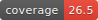

# `coverage-badge-generator`

A command-line badge generator for generic code coverage reports. Designed for use in CI pipelines.

## Example




## Usage

```
Generate an SVG code coverage badge from the command line.

USAGE:
    coverage-badge-generator [OPTIONS] <PROJECT_COVERAGE_PERCENTAGE>

FLAGS:
    -h, --help       Prints help information
    -V, --version    Prints version information

OPTIONS:
    -d, --decimal-places <decimal-places>
            Number of decimal places to round PROJECT_COVERAGE_PERCENTAGE to [default: 1]

        --failing-color <CSS_HEX_COLOR>                Bacground color for failing badge (e.g. red) [default: #e43]
    -l, --label <label>                                Badge label [default: coverage]
    -o, --output <OUTPUT_FILE>                         The output file [default: badge.svg]
        --passing-color <CSS_HEX_COLOR>                Bacground color for passing badge (e.g. green) [default: #3c1]
    -p, --passing-percent <MIN_COVERAGE_PERCENTAGE>
            Minimum Percentage for passing badge (Floating Point) [default: 95.0]

        --warning-color <CSS_HEX_COLOR>                Bacground color for warning badge (e.g. yellow) [default: #db1]
    -w, --warning-percent <MIN_COVERAGE_PERCENTAGE>
            Minimum Percentage for warning badge (Floating Point) [default: 50.0]


ARGS:
    <PROJECT_COVERAGE_PERCENTAGE>     Actual Coverage Percentage to display in the badge
```

## Shamelessly Stolen From

[romainreignier/lcov_badge_generator](https://github.com/romainreignier/lcov_badge_generator)